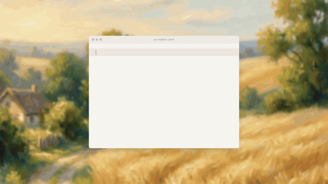

# Video2Typewriter

Turn a video into a VS Code-style typewriter B-roll, frame-synced to its
spoken narration. Distributed as an agent skill for Codex and Claude Code.

> Pipeline: **video** → ffmpeg → Whisper word-level timestamps →
> auto-generated `TEXT_SEGMENTS` (with mode hints + `delayFrames`) → injected
> into a bundled Remotion typewriter template → render to mp4.

## What it does

You give it a talking-head, screencast, or podcast clip. It produces a
typewriter animation that types out what the speaker is saying, in sync with
the audio, ready to be used as B-roll over the original or as a standalone
video. A single `git clone` is self-sufficient — the Remotion engine, sound
packs, fonts, and reference docs are all bundled.

## Demo



[Watch the demo video](demo.mp4)

## Install as an agent skill

```bash
# Codex
git clone https://github.com/dijkstra1115/Video2Typewriter.git \
  ~/.codex/skills/video2typewriter

# Claude Code
git clone https://github.com/dijkstra1115/Video2Typewriter.git \
  ~/.claude/skills/video2typewriter
```

Or ask your agent to install the skill at
`https://github.com/dijkstra1115/Video2Typewriter`; it should clone it into
the correct host-specific skills directory.

## Use

Once installed, ask your agent things like:

> 幫我把 demo.mp4 做成繁體中文的打字機影片

> Convert podcast-clip.mp4 into typewriter B-roll, English

The agent will read `SKILL.md`, ask any clarifying questions (Whisper model?
language? aspect ratio?), bootstrap a project from the bundled template, run
the pipeline, refine for storytelling, then render.

## Manual use (without an AI agent)

```bash
# 1. Bootstrap a project directory from the bundled Remotion template
SKILL=~/.codex/skills/video2typewriter   # or ~/.claude/skills/video2typewriter
PROJECT=./my-typewriter-video
mkdir -p "$PROJECT"
cp -a "$SKILL/assets/template/." "$PROJECT/"

# 2. Install JS deps (slow — Remotion pulls in Chromium)
(cd "$PROJECT" && npm install)

# 3. Install Python deps
pip install openai-whisper opencc-python-reimplemented

# 4. Run the pipeline (scripts stay in the skill — no copy needed)
bash "$SKILL/scripts/pipeline.sh" /path/to/video.mp4 --project-dir "$PROJECT" \
    --language zh --traditional --no-render

# 5. Edit $PROJECT/src/Typewriter.tsx to polish, then preview / render
(cd "$PROJECT" && npm run studio)    # interactive preview
(cd "$PROJECT" && npm run render)    # output: $PROJECT/out/typewriter.mp4
```

See [`SKILL.md`](SKILL.md) for the full workflow, and
[`references/pipeline-guide.md`](references/pipeline-guide.md) for hardware
notes, flag reference, refinement checklist, and troubleshooting.

For polished output, the agent should also run a director pass after the synced
rough draft is generated. See [`references/director-guide.md`](references/director-guide.md)
for Markdown layout, visual density, image usage, and taste rules. Concrete
patterns live in [`references/examples/`](references/examples/).

## Requirements

| | |
|---|---|
| Python | ≥ 3.9 |
| ffmpeg | on PATH |
| Node.js | ≥ 18 |
| `openai-whisper` | `pip install openai-whisper` |
| `opencc-python-reimplemented` *(optional)* | for `--traditional` Chinese conversion |

Whisper model defaults to `medium` — good Chinese accuracy on consumer
hardware. See [`references/pipeline-guide.md`](references/pipeline-guide.md#whisper-hardware-tradeoff)
for the full hardware tradeoff table.

## Project layout

```
Video2Typewriter/
├── SKILL.md                # Skill manifest (frontmatter + workflow)
├── README.md               # this file
├── demo.gif                # README inline demo
├── demo.mp4                # README demo video
├── LICENSE                 # MIT
├── THIRD_PARTY_LICENSES.md # Bundled fonts + sounds + typewriter-video
├── scripts/
│   ├── transcribe.py
│   ├── generate_segments.py
│   ├── inject_segments.py
│   └── pipeline.sh
├── assets/
│   └── template/           # Bundled Remotion typewriter-video skeleton (1.9 MB)
└── references/
    ├── pipeline-guide.md     # Pipeline internals, hardware, troubleshooting
    ├── content-guide.md      # Storytelling techniques (modes, strike, ghost, IME)
    ├── director-guide.md     # Director pass (Markdown layout, images, taste)
    ├── aroll-sync.md         # A-roll sync choreography (delayFrames math)
    ├── API.md                # TextSegment field reference + engine architecture
    ├── audio.md              # Sound packs + per-character audio overrides
    └── examples/             # Directed segment patterns agents can imitate
```

## Credits

- The Remotion typewriter engine, themes, sound packs, and template are from
  [yammaku/typewriter-video](https://github.com/yammaku/typewriter-video) (MIT).
- Mechanical keyboard sounds are from [cjlangan/MechSim](https://github.com/cjlangan/MechSim).
- Fonts: [Virgil](https://github.com/excalidraw/virgil) (Excalidraw), [Geist Pixel](https://github.com/vercel/geist-font) (Vercel).
- Transcription is [openai/whisper](https://github.com/openai/whisper).

See [`THIRD_PARTY_LICENSES.md`](THIRD_PARTY_LICENSES.md) for full license texts.

## License

MIT — see [`LICENSE`](LICENSE).
